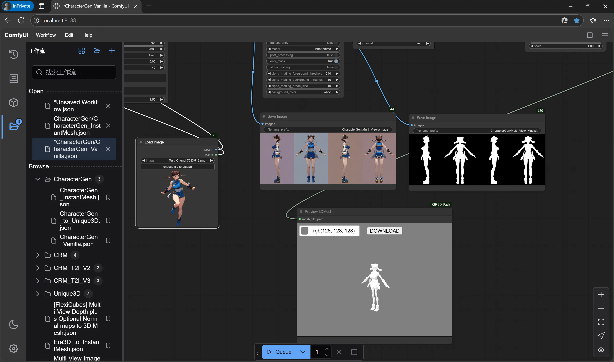

# Comfy3D Windows Portable

[.text-center]
English | *link:README.zh.adoc[中文]*

A semi-portable package dedicated for running 
https://github.com/MrForExample/ComfyUI-3D-Pack[ComfyUI-3D-Pack]
on Windows.

## What Can It Do?

This build, `pt24-cu121`, is based on PyTorch 2.4.0 with CUDA 12.1,
targeting the
https://github.com/MrForExample/ComfyUI-3D-Pack/tree/bdc5e3029ed96d9fa25e651e12fce1553a4422c4[Oct 18, 2024]
version of ComfyUI-3D-Pack. Workflows that are "too new" or "too old" are not supported in this build.

I tested all the example workflows on a fairly-old TITAN Xp GPU (12GB VRAM). The results are as follows:

[%autowidth,cols=4]
|===
|Workflow|Status|Screenshot|Memo

|CharacterGen_Vanilla
|🆗
|link:screenshots-pt24/CharacterGen_Vanilla.webp[🖼️]
|

|CharacterGen_to_Unique3D
|🆗
|link:screenshots-pt24/CharacterGen_to_Unique3D.webp[🖼️]
|

|CharacterGen_InstantMesh
|❓
|
|Out of memory at "InstantMesh Reconstruction Model" node.

|CRM MVDiffusion_to_Craftsman
|🆗
|link:screenshots-pt24/CRM_MVDiffusion_to_Craftsman.webp[🖼️]
|

|CRM MVDiffusion_to_Unique3D
|🆗
|link:screenshots-pt24/CRM_MVDiffusion_to_Unique3D.webp[🖼️]
|

|CRM_Img_to_Multi-views_to_CCMs_to_Mesh
|🆗
|link:screenshots-pt24/CRM_Img_to_Multi-views_to_CCMs_to_Mesh.webp[🖼️]
|

|CRM MVDiffusion_to_InstantMesh
|❌
|
|PyTorch version incompatible.

|CRM_T2I_V2 +
CRM_T2I_V3
|❓
|
|https://github.com/MrForExample/ComfyUI-3D-Pack/issues/311[Model not released yet].

|Unique3D_All_Stages
|🆗
|link:screenshots-pt24/Unique3D_All_Stages.webp[🖼️]
|As well as Unique3D stage 0 to 3.

|Unique3D_with_Era3D_All
|❌
|
|PyTorch version incompatible.

|[FlexiCubes] Multi-View Depth plus Optional Normal maps to 3D Mesh
|🆗
|link:screenshots-pt24/FlexiCubes.webp[🖼️]
|

|Era3D_to_InstantMesh
|❌
|
|PyTorch version incompatible.

|Multi-View-Images_to_Instant-NGP_to_ DiffRast_to_3DMesh
|❌
|
|Throwing ('NoneType' object has no attribute 'ray_aabb_intersect') at "Instant NGP" node.

|MVDream_to_Large_Multiview_Gaussian_ Model_to_3DGS and_3DMesh
|❌
|
|Throwing ('NoneType' object has no attribute 'ray_aabb_intersect') at "Convert 3DGS to Mesh with NeRF and Marching Cubes" node.

|Render_Mesh_and_3DGS_Example
|🆗
|link:screenshots-pt24/Render_Mesh_and_3DGS_Example.webp[🖼️]
|

|StableFast3D_to_Mesh
|🆗
|link:screenshots-pt24/StableFast3D_to_Mesh.webp[🖼️]
|

|Triplane_Gaussian_Transformers_to_ 3DGS_and_3DMesh
|❌
|
|Throwing ('NoneType' object has no attribute 'ray_aabb_intersect') at "Convert 3DGS to Mesh with NeRF and Marching Cubes" node.

|TripoSR_to_Mesh
|🆗
|link:screenshots-pt24/TripoSR_to_Mesh.webp[🖼️]
|The "easy" model that always works.

|Using_Stack_Orbit_Camera_Poses_
to_conditioning_StableZero123
|🆗
|link:screenshots-pt24/Orbit_Camera.webp[🖼️]
|

|Wonder3D_to_Large_Multiview_ Gaussian_Model_to_3DGS and_3DMesh
|❌
|
|Throwing ('NoneType' object has no attribute 'ray_aabb_intersect') at "Convert 3DGS to Mesh with NeRF and Marching Cubes" node.

|Zero123Plus_to_InstantMesh
|🆗
|link:screenshots-pt24/Zero123Plus_to_InstantMesh.webp[🖼️]
|

|===

## Before You Start...

Few things I want to mention first, that may save you A LOT of time...

1. If you're looking for Stable Fast 3D, which generate 3D-mesh from single image, just use
https://github.com/YanWenKun/StableFast3D-WinPortable[StableFast3D-WinPortable].
It does only one thing and does it well.

2. Everything in Comfy3D works more smoothly on Linux, as well as WSL2. Most 3D workflows are research-oriented and far from production-ready. By installing & running them you're essentially replicating the development environment used by researchers. Many components need to be compiled before running, and this is exactly where Linux excels.
Check out
https://github.com/MrForExample/ComfyUI-3D-Pack/blob/main/Dockerfile[Dockerfile]
or my
https://github.com/YanWenKun/ComfyUI-Docker/tree/main/comfy3d-pt25[Docker image]
if you're familiar with containers.

3. Know your GPU's CUDA arch number. For example, RTX 2080 is `7.5`, RTX 3090 is `8.6` and RTX 4090 is `8.9`.
You can find the number in
https://arnon.dk/matching-sm-architectures-arch-and-gencode-for-various-nvidia-cards/[this article].

## Download, Install, Compile and Run

### 1. Basic Requirements

1.1. Install 
https://developer.nvidia.com/cuda-12-1-1-download-archive?target_os=Windows&target_arch=x86_64&target_version=11&target_type=exe_network[CUDA Toolkit 12.1.1]
or
https://developer.nvidia.com/cuda-12-4-1-download-archive?target_os=Windows&target_arch=x86_64&target_version=11&target_type=exe_network[CUDA Toolkit 12.4.1].
Both are fine, choose 12.4.1 if you have other newer ComfyUI instances.

** Only
https://github.com/YanWenKun/ComfyUI-Windows-Portable/raw/c305814599057e77baa72a76eacd21cf021d1656/docs/cuda-toolkit-install-selection.webp[Libraries and Compilers]
are needed to install.

** If your GPU driver is outdated (<530 for CUDA 12.1, <550 for CUDA 12.4), you can install the driver provided by the CUDA Toolkit installer. Otherwise, you don't need to downgrade the driver version.

1.2. Install Visual Studio Build Tools 2022
(
https://visualstudio.microsoft.com/downloads/?q=build+tools[Page]
|
https://aka.ms/vs/17/release/vs_BuildTools.exe[EXE]
).

** During the setup, select "Desktop development with C++" workload.

** If you're using CUDA 12.1, you need to select MSVC 17.4 (or
https://docs.nvidia.com/cuda/archive/12.1.0/cuda-installation-guide-microsoft-windows/index.html#id2[earlier]
).

** For CUDA 12.4, it's fine to use current default MSVC 17.12.

### 2. Download and Config

2.1. Download the package files from the release page:

** https://github.com/YanWenKun/Comfy3D-WinPortable/releases/tag/r3-pt24
** Note that there are multiple files (compressed in volumes) that need to be downloaded. Extract it to a convenient place.

2.2. Edit `!FIRST_RUN-compile-install.bat`

You can see the line:

 set TORCH_CUDA_ARCH_LIST=6.1+PTX

Edit it according to your 
https://arnon.dk/matching-sm-architectures-arch-and-gencode-for-various-nvidia-cards/[GPU arch].

For example, for an RTX 4060 Ti, it should be:

 set TORCH_CUDA_ARCH_LIST=8.9

2.3. Edit `run.bat`

You can see the line (again):

 set TORCH_CUDA_ARCH_LIST=6.1+PTX

Edit it like you just did in the last step.

There are few more settings available in this start script, such as:

** Set proxy
** Do not open browser after starting

Each line of configuration has a description above it.
If needed, uncomment the according line (remove `rem` at the beginning),
edit it and save the file.

### 3. (Optional) Extra Config

3.1. The ComfyUI-Manager and AIGODLIKE-ComfyUI-Translation are installed but disabled.
If you really want to use them, in `ComfyUI\custom_nodes` folder, rename them and remove the trailing `.disabled`, so they will be loaded on start.

** ComfyUI-Manager may damage the dependencies of Comfy3D, so it's disabled by default.
** https://github.com/AIGODLIKE/AIGODLIKE-ComfyUI-Translation[AIGODLIKE-ComfyUI-Translation] is for multilingual translation of ComfyUI.

3.2. If you want to use Sandboxie to isolate this instance, the following steps should be executed in a sandbox.
In addition, I recommend to set the program folder (`Comfy3D_WinPortable`) to "Full Access" under "Sandbox Settings - Resource Access", to improve disk I/O.

### 4. First Start

4.1. Run `!FIRST_RUN-compile-install.bat`. Wait until it finish installation. If it fails, simply run it again.

4.2. If you are going to run Unique3D workflows, run `download-models-for-Unique3D.bat`.

4.3. Run `run.bat`. After starting, the program will automatically open a browser, or you can visit: http://localhost:8188/

4.4. In the left sidebar, you can find the "Workflows" button, the example workflows are listed there. The example input files are already in the `input` folder. Open a workflow and click "Queue" at bottom of the page to run the workflow.

To start the program in the future, simply run `run.bat`.

## Troubleshooting

### Force-Update

It is not recommended to update any component of this package, whether it's Python, ComfyUI or Custom Nodes
("If it works, don't fix it").

But if you really need to update ComfyUI and Custom Nodes (except 3D-Pack), 
there's a script to do that.
Run this in your Git Bash:

 bash force-update-all.sh

This script will force git-pull all the repositories.

Note that `ComfyUI\custom_nodes\ComfyUI-3D-Pack` folder is not a git repository, so it won't be affected by this script.

### Re-Compile and Re-Install Dependencies

Just like the FIRST_RUN script did,
the `reinstall-deps-for-3d.bat` script will attempt to compile and install the dependencies of 3D-Pack.

You need to edit this file and set TORCH_CUDA_ARCH_LIST as well.

There are few differences from the FIRST_RUN, this script will:

** Download the latest source repos, not the targeted versions. This may help with compatibility issues when the FIRST_RUN doesn't work.

** Additionally compile-install `kiuikit` and `nvdiffrast`. In my tests, it's not necessary to do so in the FIRST_RUN. I put them here for fail-safe.

** Keep temporary files and save artifacts (.whl files) in the working folder `tmp_build`, allowing you to reuse them. Keep in mind they are not essentially portable.

## What's Next

The next package will be based on PyTorch 2.5.1 with CUDA 12.4.
It will only focus on new workflows since November 2024, such as Hunyuan3D-1.

It's now working but not released yet.
If you'd like to have a preview, simply fork this repo and go to "Actions" page, then you can build it using GitHub Actions.
After building, you can find the 7z files in "Releases" page and download them.
